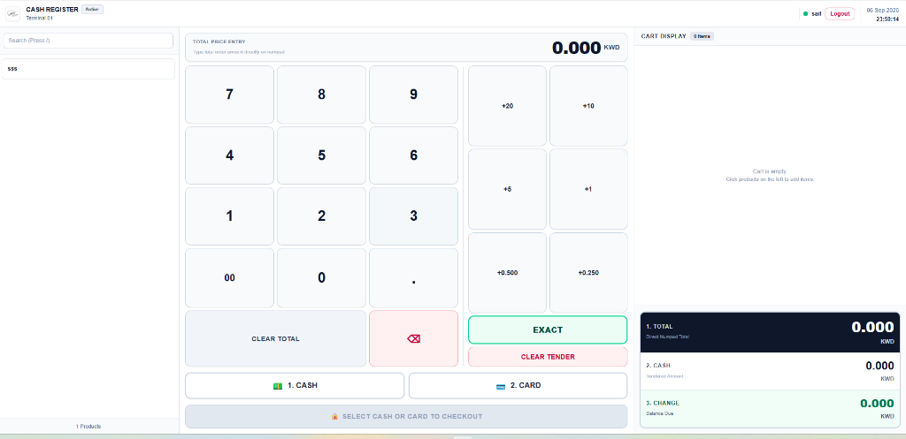

# Cash Register & Point of Sale (POS) System

A lightweight manual cash register and POS application designed for anyone who sells products without needing a big or complicated setup. Built specifically for business owners and retailers who want to record their daily transactions and keep clean sales records easily.

Features cashier and admin accounts, simple product management, and comprehensive sales analytics with export options (PDF & Excel).



---

## System Requirements

- **PHP**: 8.3 or higher (PHP 8.5 compatible)
- **Composer**: 2.x
- **Node.js & npm**: 18.x or higher *(only required if installing from source)*
- **PHP Extensions**: `pdo`, `pdo_sqlite` (or `pdo_mysql`), `openssl`, `mbstring`, `tokenizer`, `xml`, `json`, `zip`
- **Database Engine**: SQLite (default zero-config) or MySQL 8.0+ / MariaDB 10.4+

---

## Production Deployment

> ### ⚠️ Critical Web Server Configuration
> Your web server **DocumentRoot must point directly to the `/public` directory** (e.g. `root /var/www/cash-register/public;` on Nginx or `DocumentRoot /var/www/cash-register/public` on Apache), **never** to the repository root directory.
>
> Pointing DocumentRoot to the project root exposes your `.env` configuration, database files, and system logs to the public web.
>
> Built-in `.htaccess` files are provided in both the root directory and `/public` for Apache and LiteSpeed servers as defense-in-depth, but setting the DocumentRoot to `/public` remains the industry standard.

### Production Setup Options

Choose one of the two options below to deploy the application:

#### Option 1: Release ZIP Package (Recommended — Web Installer)
The release package comes with pre-compiled assets and dependencies, allowing you to install without Node.js or npm.

1. Download the latest release `.zip` archive from GitHub Releases.
2. Upload and extract the archive to your server directory (e.g., `/var/www/cash-register`).
3. Set the required directory permissions:
   ```bash
   chown -R www-data:www-data storage bootstrap/cache
   chmod -R 775 storage bootstrap/cache
   ```
4. Point your web server document root to the `/public` directory.
5. Open your domain in your web browser (or navigate to `http://your-domain.com/install`).
6. Follow the on-screen installation wizard to select your database engine (SQLite or MySQL) and create your first administrator account.
7. *(Optional cleanup)*: Once the installation wizard locks, you may safely delete the `app/Installer` directory.

---

#### Option 2: Manual Setup from Source / Git

1. **Set directory permissions**:
   ```bash
   chown -R www-data:www-data storage bootstrap/cache
   chmod -R 775 storage bootstrap/cache
   ```
2. **Install dependencies & compile assets**:
   ```bash
   composer install --no-dev --optimize-autoloader
   npm install && npm run build
   ```
3. **Run headless installation command**:
   ```bash
   # SQLite (Default zero-config):
   php artisan app:install --database=sqlite --admin-username=admin --admin-password=yourSecurePassword

   # Or MySQL:
   php artisan app:install --database=mysql --admin-username=admin --admin-password=yourSecurePassword --company="My Store"
   ```
4. **Cache configuration & routes for maximum performance**:
   ```bash
   php artisan config:cache
   php artisan route:cache
   php artisan view:cache
   ```

---

## Development Setup

```bash
# 1. Install dependencies
composer install
npm install

# 2. Setup environment & encryption key
cp .env.example .env
php artisan key:generate

# 3. Compile assets (or run 'npm run dev' for live hot-reload)
npm run build

# 4. Migrate database & seed default local accounts
php artisan migrate --seed

# 5. Start development server
php artisan serve
```

### Useful Commands
- **Switch Database Engine**: `php artisan db:switch sqlite --migrate` or `php artisan db:switch mysql --migrate`
- **Seed Demo Data (Local only)**: `php artisan db:seed`
- **Run Security & Feature Tests**: `php artisan test`
- **Code Style Formatter**: `vendor/bin/pint --format agent`

---

## Accounts & Authentication

### Local Development / Testing (Seeded Accounts)
When running `php artisan db:seed` in local environment:

| Role | Username | Password | Landing Page |
|---|---|---|---|
| **Admin** | `admin` | `password` | `/admin` (Analytics, Products, Cashiers, Settings) |
| **Cashier** | `cashier` | `password` | `/pos` (Cash Register Terminal) |

> 🔒 **Security Notice for Production**:
> The `DatabaseSeeder` automatically disables default accounts in `production` environment (`APP_ENV=production`). In production, administrator credentials are created exclusively via the web setup wizard (`/install`) or via `php artisan app:install`.

---

## Security Architecture

The application includes enterprise-grade cybersecurity controls:
- **Strict Role Separation**: Route-level middleware (`admin` and `cashier`) enforces strict access boundaries.
- **SQL & Parameter Injection Defense**: Database name identifiers and raw database routines enforce regex bounds and safe escaping.
- **SSRF & Network Probing Protections**: Database connection testers restrict private ranges, loopbacks, and cloud metadata addresses (`169.254.169.254`).
- **File System & Export Hardening**: DomPDF logo loading enforces `realpath` confinement to public storage and validates MIME types. Spreadsheet exports sanitize formula injection characters (`=`, `+`, `-`, `@`, `|`).
- **Web Server Protection**: Includes root and public `.htaccess` security rules blocking direct access to `.env`, SQLite files, source code, and release archives.
- **Security Headers**: Transmits `Content-Security-Policy`, `Strict-Transport-Security` (HSTS), `X-Frame-Options` (`SAMEORIGIN`), and `X-Content-Type-Options` (`nosniff`).
- **Brute-Force Rate Limiting**: Throttles failed logins, database test calls, and computational report exports.

---

## License

Open-source software licensed under the [MIT license](LICENSE).
